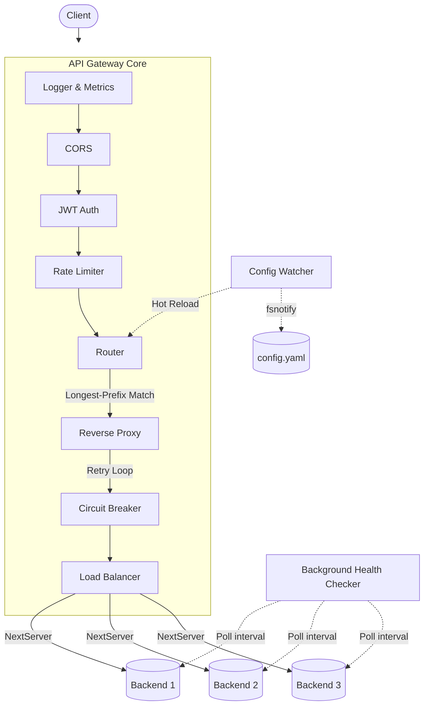

# Custom API Gateway & L7 Load Balancer

## Project Overview

A high-performance and lightweight API Gateway written in Go. The gateway handles routing, load balancing, health checking, and critical edge features like rate limiting and JWT authentication.

## Architecture

The gateway processes incoming requests through a strict middleware pipeline before routing them to healthy backend servers.



## Quickstart

### Prerequisites
- [Go 1.26+](https://golang.org/doc/install)
- [Docker](https://docs.docker.com/get-docker/)

### Running Locally with Docker

The easiest way to test the gateway is using the included `docker-compose.yml`, which spins up the gateway and three mock backends.

1. **Start the cluster in the background:**
   ```bash
   make docker-up
   ```
2. **Test the gateway:**
   The gateway runs on `localhost:8080`. (Note: You will need a valid JWT token to pass the authentication middleware, or you can disable JWT in `config.yaml`).
3. **Tear down the cluster:**
   ```bash
   make docker-down
   ```

### Running Natively
```bash
make build
JWT_SECRET=mysecret ./bin/gateway
```

## Configuration Reference

The gateway is configured via a `config.yaml` file. Changes to this file are automatically detected via `fsnotify` and reloaded with zero downtime.

```yaml
server:
  port: 8080                 
  read_timeout: 5s           
  write_timeout: 10s         
  tls:
    enabled: false           # Set to true and provide cert/key files for HTTPS

routes:
  - path: /api/orders        # Matched via longest-prefix
    strip_prefix: false      # Removes /api/orders before forwarding
    strategy: round_robin    # Options: round_robin, weighted_round_robin, least_conn
    backends:
      - url: http://backend1:9000
        weight: 1            # Used by weighted_round_robin
      - url: http://backend2:9000
        weight: 2

health_check:
  interval: 10s              # Ping frequency
  timeout: 2s                # Ping timeout
  path: /healthz             # Health endpoint

rate_limit:
  requests_per_second: 100   # Max sustained RPS per IP
  burst: 200                 # Max instantaneous burst allowed

auth:
  jwt_secret: ${JWT_SECRET}  

cors:
  allowed_origins: ["*"]
  allowed_methods: ["GET", "POST", "PUT", "DELETE", "OPTIONS"]

circuit_breaker:
  failure_threshold: 3       # Consecutive failures before circuit opens (fast-fails)
  success_threshold: 2       # Consecutive successes to close circuit again
  timeout: 5s                # Time to wait in Open state before testing again

retry:
  max_attempts: 3            # retry attempts at 5xx errors
  base_delay: 100ms          # Starting backoff delay
  max_delay: 2s              # Maximum backoff delay
```

## Benchmark Results

The gateway was benchmarked using [k6](https://k6.io/) simulating 50 concurrent virtual users over 25 seconds against a 2-backend route.

| Metric | Result |
|--------|--------|
| **Throughput (RPS)** | `3,481 req/sec` |
| **Average Latency** | `1.05 ms` |
| **p(99) Latency** | `4.81 ms` |
| **Total Requests** | `87,030` |

*Note: The rate limiter accurately dropped 97% of this traffic with HTTP 429, allowing exactly 100 RPS through as configured. The gateway remained fully responsive.*

## Extending the Gateway

### Adding a New Balancer Strategy

1. **Implement the `Balancer` interface:**
   Create a new file in `internal/balancer/` and implement the `NextServer` method.
   ```go
   type Balancer interface {
       NextServer() (*Backend, error)
   }
   ```

2. **Register it in the factory:**
   Open `internal/balancer/balancer.go` and add your algorithm to the switch statement in `NewBalancer()`:
   ```go
   func NewBalancer(strategy string, pool *ServerPool) (Balancer, error) {
       switch strategy {
       case "round_robin":
           return NewRoundRobin(pool), nil
       case "ip_hash":
           return NewIPHash(pool), nil // <-- Your custom strategy
       // ...
       }
   }
   ```

3. **Update config:**
   Set `strategy: ip_hash` in your `config.yaml`.